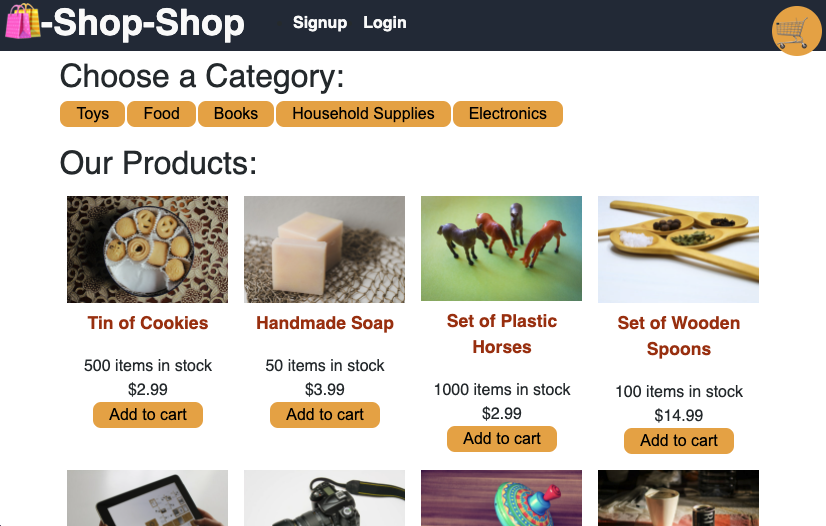

# Shop-Shop

## Description 
This project is a full stack web application using the MERN Stack to create an e-commerce website using React and Redux API with Stripe payments. Users will be able to checkout when there is lost of connection and view their order history out of checkout. Users will also be able to sign up and login in to their account. This application uses a global state.

## Table of Contents
* [Installation](#installation)
* [Usage](#usage)
* [License](#license)
* [Contributing](#contributing)
* [Tests](#tests)
* [Questions](#questions)

## Installation 
The user should clone the repository from GitHub and install dependencies. For development or testing purposes, run `npm install` on both client and server directories to install dependencies. There are two servers for client side and server side, which can be run on their own. To run both servers at the same time, open the root directory and run `npm run develop`.

## Usage 
This application will allow users to add products to their cart either from the main page or product page. Users can then checkout using Stripe and view their order history. 
Please view deployed application on [Heroku](https://damp-plains-67428.herokuapp.com/) 

## License 
This project is license under MIT.

## Contributing 
Contributors should read the installation section. 

## Tests
This application tests the reducers. 

## Questions
  Reach out via email or GitHub.  
  cassie.s.simpson@gmail.com  
  [https://github.com/cassie-s](https://github.com/https://github.com/cassie-s/)